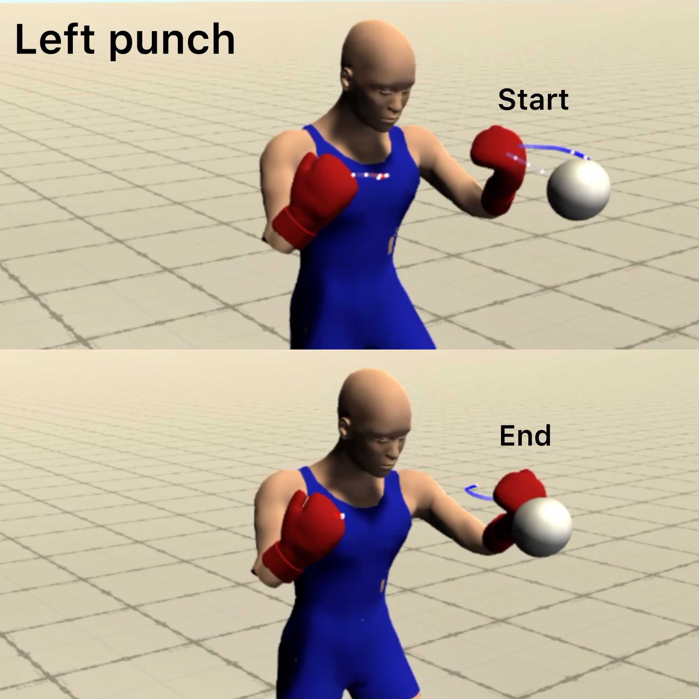
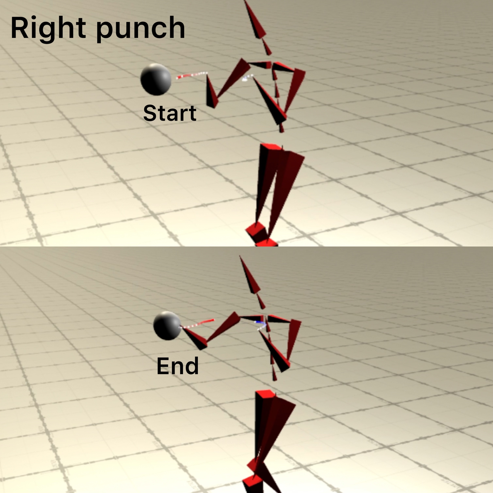

# MSc Thesis: Simulating Fast-Movements with Mixture-of-Expert models
In this thesis, we hypothesise that a neural model based on the mixture of experts concept
can be developed to synthesise fast boxing actions interactively. As the primary goal here
is to synthesise natural-looking motions, a novel boxing dataset consisting of the fast
actions of punching and stepping is prepared. This is followed by the design of effective
representations of motion states used to train our neural models that are incorporated
in a boxing controller system to facilitate user interaction with the neural synthesised
motions. Our system allows a user to specify the exact target of the punches and the direction of
the steps to produce motions in the boxing style. This system can synthesise high-quality
boxing actions despite being trained on limited data. To achieve the best synthesis
results using such data, several experiments are conducted to determine effective motion
states for producing more accurate punching and stepping actions. Our experimental
results show that formulating the motion states by considering the fastness of the boxing
actions leads to more accurate and natural-looking results for both targeted punching
and user-directed stepping actions.

**More details in [final presentation slides](thesis_docs/BoxingSynthesis_ThesisDefense_Chirag_Final_Presentation.pdf) and 
in the [Master Thesis Report](thesis_docs/Master_Thesis_Chirag_print_29Nov_rotated.pdf).**

### Visualization:

**Left punch**

**Right punch**

**Forward movement with boxing posture**

### Project videos on Youtube:

Overview: https://youtu.be/DlOHiAX3vNk ==> This video contains the visualisation results for the boxing motions synthesised using the mixture-of-experts neural model in my master thesis at Saarland University.

Punch control visualization: https://youtu.be/lG8QBn0-bDI

Unstructured visualization: https://youtu.be/BHrd0D1F61o

--------------------
# Technical Documentation

## Supported Commands

# 1. Data Statistics

* ``python -m data.raw_data.punch_label_gen.analyze.stats``
 
# 2. Data Preparation for Machine Learning
* Multiple datasets
  * Experiment 0:
    * ``python -m data.neural_data_prep.extract_multiple -e 0 -n learning_rate``
    * ``python -m data.neural_data_prep.extract_multiple -e 0 -n num_gating_experts``
    * ``python -m data.neural_data_prep.extract_multiple -e 0 -n num_hidden_neurons``
  * Experiment 1:
    * ``python -m data.neural_data_prep.extract_multiple -e 1 -n root_tr_exp_fr_10 -tr 3 4 5 6 -tw 5 -fr 10 ``
    * ``python -m data.neural_data_prep.extract_multiple -e 1 -n root_tr_exp_fr_9 -tr 5 -tw 5 -fr 9 ``
    * ``python -m data.neural_data_prep.extract_multiple -e 1 -n root_tr_exp_fr_8 -tr 5 -tw 5 -fr 8 ``
    * ``python -m data.neural_data_prep.extract_multiple -e 1 -n root_tr_exp_fr_5 -tr 4 6 -tw 5 -fr 5 ``
    * ``python -m data.neural_data_prep.extract_multiple -e 1 -n root_tr_exp_fr_3 -tr 5 -tw 5 -fr 3 ``
    * 
    * ``python -m data.neural_data_prep.extract_multiple -e 1 -n root_tr_exp_fr_2 -tr 7 -tw 5 -fr 2 `` 
    * ``python -m data.neural_data_prep.extract_multiple -e 1 -n root_tr_exp_fr_4 -tr 4 7 -tw 5 -fr 4 `` 
    * ``python -m data.neural_data_prep.extract_multiple -e 1 -n root_tr_exp_fr_5 -tr 3 -tw 5 -fr 5 ``
    * ``python -m data.neural_data_prep.extract_multiple -e 1 -n root_tr_exp_fr_6 -tr 5 -tw 5 -fr 6 ``  
    * ``python -m data.neural_data_prep.extract_multiple -e 1 -n root_tr_exp_fr_7 -tr 4 -tw 5 -fr 7 ``  
    * ``python -m data.neural_data_prep.extract_multiple -e 1 -n root_tr_exp_fr_9 -tr 7 -tw 5 -fr 9 `` 
    * 
    * ``python -m data.neural_data_prep.extract_multiple -e 1 -n root_tr_exp_fr_1 -tr 5 10 -tw 5 -fr 1 `` 
    * ``python -m data.neural_data_prep.extract_multiple -e 1 -n root_tr_exp_fr_2 -tr 5 10 -tw 5 -fr 2 `` 
    * 
    * ``python -m data.neural_data_prep.extract_multiple -e 1 -n root_tr_exp_fr_2 -tr 1 2 3 4 6 8 9 -tw 5 -fr 2 `` 
  * Experiment 2:
    * ``python -m data.neural_data_prep.extract_multiple -e 1 -n wrist_tr_exp_fr_1 -tr 5 -tw 5 6 7 8 9 10``
    * ``python -m data.neural_data_prep.extract_multiple -e 1 -n wrist_tr_exp_fr_2 -tr 5 -tw 6 7 8 9 10 -fr 2``
    * ``python -m data.neural_data_prep.extract_multiple -e 1 -n wrist_tr_exp_fr_3 -tr 5 -tw 5 7 8 9 -fr 3``
    * 
    * ``python -m data.neural_data_prep.extract_multiple -e 1 -n wrist_tr_exp_fr_1 -tr 5 -tw 1 2 3 4``
    * ``python -m data.neural_data_prep.extract_multiple -e 1 -n wrist_tr_exp_fr_2 -tr 5 -tw 1 2 3 4 5 -fr 2``
    * ``python -m data.neural_data_prep.extract_multiple -e 1 -n wrist_tr_exp_fr_3 -tr 5 -tw 1 2 3 4 6 10 -fr 3``
  * Experiment 3:
    * ``python -m data.neural_data_prep.extract -frd 3 -n no_wrist_tr``
* Single dataset:
  * ``python -m data.neural_data_prep.extract -d -l``

Flags: -d for dev mode and -l for local machine development

# 3. Mode Adaptive Neural Network training
* Train Multiple models
  * Experiment 0:
    * ``python -m train.start_multiple -e 0 -n learning_rate -lr 0.05 0.001 0.005 0.0001 0.0005``
    * ``python -m train.start_multiple -e 0 -n num_gating_experts -ng 4 6 8``
    * ``python -m train.start_multiple -e 0 -n num_gating_experts -nh 250 275 300``
  * Experiment 1:
    * ``python -m train.start_multiple -e 1 -n root_tr_exp_fr_10 -tr 3 4 5 6 -tw 5 -fr 10``
    * ``python -m train.start_multiple -e 1 -n root_tr_exp_fr_9 -tr 5 -tw 5 -fr 9``
    * ``python -m train.start_multiple -e 1 -n root_tr_exp_fr_8 -tr 5 -tw 5 -fr 8``
    * ``python -m train.start_multiple -e 1 -n root_tr_exp_fr_5 -tr 4 6 -tw 5 -fr 5``
    * ``python -m train.start_multiple -e 1 -n root_tr_exp_fr_3 -tr 5 -tw 5 -fr 3``
    * 
    * ``python -m train.start_multiple -e 1 -n root_tr_exp_fr_2 -tr 7 -tw 5 -fr 2``
    * ``python -m train.start_multiple -e 1 -n root_tr_exp_fr_4 -tr 4 7 -tw 5 -fr 4``
    * ``python -m train.start_multiple -e 1 -n root_tr_exp_fr_5 -tr 3 -tw 5 -fr 5``
    * ``python -m train.start_multiple -e 1 -n root_tr_exp_fr_6 -tr 5 -tw 5 -fr 6``
    * ``python -m train.start_multiple -e 1 -n root_tr_exp_fr_7 -tr 4 -tw 5 -fr 7``
    * ``python -m train.start_multiple -e 1 -n root_tr_exp_fr_9 -tr 7 -tw 5 -fr 9``
    * 
    * ``python -m train.start_multiple -e 1 -n root_tr_exp_fr_1 -tr 5 10 -tw 5 -fr 1``
    * ``python -m train.start_multiple -e 1 -n root_tr_exp_fr_2 -tr 5 10 -tw 5 -fr 2``
    * 
    * ``python -m train.start_multiple -e 1 -n root_tr_exp_fr_2 -tr 1 2 3 4 6 8 9 -tw 5 -fr 2``
  * Experiment 2:
    * ``python -m train.start_multiple -e 1 -n wrist_tr_exp_fr_1 -tr 5 -tw 5 6 7 8 9 10``
    * ``python -m train.start_multiple -e 1 -n wrist_tr_exp_fr_2 -tr 5 -tw 6 7 8 9 10 -fr 2``
    * ``python -m train.start_multiple -e 1 -n wrist_tr_exp_fr_3 -tr 5 -tw 5 7 8 9 -fr 3``
    * 
    * ``python -m train.start_multiple -e 1 -n wrist_tr_exp_fr_1 -tr 5 -tw 1 2 3 4``
    * ``python -m train.start_multiple -e 1 -n wrist_tr_exp_fr_2 -tr 5 -tw 1 2 3 4 5 -fr 2``
    * ``python -m train.start_multiple -e 1 -n wrist_tr_exp_fr_3 -tr 5 -tw 1 2 3 4 6 10 -fr 3``
  * Experiment 3:
    * ``python -m train.start -frd 3 -n no_wrist_tr``
* Train Single Model:
  * ``python -m train.start -d -l``

Flags: -d for dev mode and -l for local machine development

# 5. Download models, logs and network_config
* Download experiment 
  * ``python -m miscellaneous.download_exp_folder -e wrist_tr_exp``
* Download single model
  * ``python -m miscellaneous.download -m  learning_rate/fr_1_tr_5_5_ep_150/2021-09-19_14-33-42``
  * ``python -m miscellaneous.download -m  fr_1_tr_5_5_ep_150/2021-09-19_14-33-42``

# 4. Launch Flask Server 
* Launch experiment folder
  * ``python -m vis.backend.server.flask.launch_exp``
* Launch single model
  * ``python -m vis.backend.server.flask.launch``

